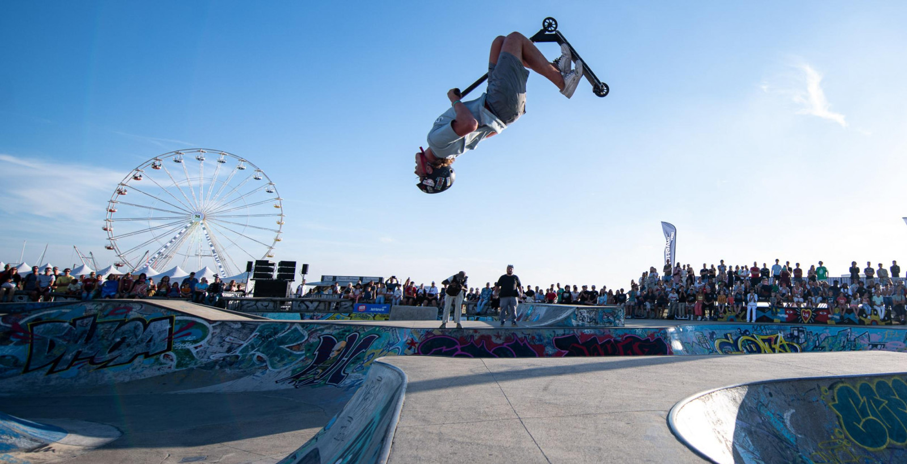

```{r setup, include=FALSE}
library(readxl)
library(leaflet)
library(pacman)
pacman::p_load(dplyr,sf,ggplot2,raster,deldir,sp,RColorBrewer,tmap,mapsf)
library(viridis)
library(spatstat)

# Import et traitement des données
iris_shp <- st_read("data/georef-france-iris-millesime.shp")
iris_shp$com_name <- gsub(pattern="\\['|\\']", replacement='', iris_shp$com_name)
iris_shp$iris_code <- gsub(pattern="\\['|\\']", replacement='', iris_shp$iris_code)
iris_shp$iris_name <- gsub(pattern="\\['|\\']", replacement='', iris_shp$iris_name)
iris_data <- read_excel("data/iris_35.xlsx")

iris_rennes <- iris_shp %>% filter(com_name=="Rennes")

# Compacter l'ensemble des données de résidences
iris_data$nb_residence_princ <- iris_data$Res_princ_30_moins_40_m2 + 
                               iris_data$Res_princ_40_moins_60_m2 + 
                               iris_data$Res_princ_60_moins_80_m2 + 
                               iris_data$Res_princ_80_moins_100_m2 + 
                               iris_data$Res_princ_100_moins_120_m2

# Ajout des variables souhaitées
colnames(iris_rennes)[20] <- "CODE_IRIS"

iris_rennes <- merge(iris_rennes, 
                     iris_data[,c("CODE_IRIS", "1er_quartile_euro", "3e_quartile_euro",
                                 'Actifs_15-64_ans2', "Pop_15-64_ans", "Delta_Pop_20-64_ans",
                                 "nb_residence_princ", "Superette", "Tennis-nombre_courts",
                                 "Pop_menages", "Pop_0-19_ans", "Salles_multisports_gymnase", "Pharmacie")],
                     by="CODE_IRIS")

colnames(iris_rennes)[c(31:42)] <- c("premier_quartile_revenu", "troisieme_quartile_revenu",
                                     "Actif_total", "Pop_15_64", "Delta_pop_20_64ans",
                                     "Nb_residence_principale", "Superette", "Nb_courts_tennis",
                                     "Pop_menages", "Pop_0_19", "Gymnases", "Pharmacie")

iris_rennes <- iris_rennes %>% 
  mutate_at(vars(premier_quartile_revenu, troisieme_quartile_revenu, Actif_total, 
                Pop_15_64, Delta_pop_20_64ans, Nb_residence_principale, Superette, 
                Nb_courts_tennis, Pop_menages, Pop_0_19, Gymnases, Pharmacie), 
            ~ na_if(., 0))

skateparks <- read_excel("data/skateparks.xlsx", col_names = TRUE)
# Remplacement des virgules par des points et conversion en numérique
skateparks$Latitude <- as.numeric(gsub(",", ".", skateparks$Latitude))
skateparks$Longitude <- as.numeric(gsub(",", ".", skateparks$Longitude))

skateparks_sf <- st_as_sf(skateparks, 
                         coords = c("Longitude", "Latitude"), 
                         crs = 4326)

skateparks_sf <- st_transform(skateparks_sf, st_crs(iris_rennes))
skateparks_iris <- st_join(skateparks_sf, iris_rennes, left = TRUE)

# Chargement des résultats préalablement calculés pour les isochrones
if (file.exists("data/isochrones/all_isochrones.rds") && file.exists("data/isochrones/iso7min.rds")) {
  message("Chargement des isochrones préalablement calculés...")
  results <- readRDS("data/isochrones/all_isochrones.rds")
  iso7min <- readRDS("data/isochrones/iso7min.rds")
} else {
  # Si les fichiers n'existent pas, créer des buffers simples pour l'exemple
  message("Création de buffers simples comme substitut aux isochrones...")
  results <- list()
  for (i in 1:nrow(skateparks_sf)) {
    # Créer des buffers à différentes distances comme approximation simpliste d'isochrones
    buffer_distances <- c(300, 700, 1100, 1500)  # en mètres, approximation grossière
    iso <- st_buffer(skateparks_sf[i,], buffer_distances)
    iso$time <- c(300, 420, 540, 660)  # 5, 7, 9, 11 minutes en secondes
    iso$minutes <- iso$time / 60
    results[[i]] <- iso
  }
  
  # Extraire les buffers de 7 minutes
  iso7min_list <- lapply(results, function(x) {
    if (!is.null(x) && nrow(x) > 0) {
      return(x[x$time == 420, ])
    } else {
      return(NULL)
    }
  })
  iso7min_list <- iso7min_list[!sapply(iso7min_list, is.null)]
  if (length(iso7min_list) > 0) {
    iso7min <- do.call(rbind, iso7min_list)
  } else {
    iso7min <- NULL
    warning("Aucun isochrone de 7 minutes disponible.")
  }
}

# Calcul du nombre de skateparks accessibles par IRIS
if (!is.null(iso7min)) {
  iris_rennes$nb_skateparks_per_iris <- rowSums(
    ifelse(st_intersects(x = iris_rennes, y = iso7min, sparse = FALSE), 1, 0)
  )
  iris_rennes$nb_skateparks_per_iris <- as.factor(as.character(iris_rennes$nb_skateparks_per_iris))
} else {
  iris_rennes$nb_skateparks_per_iris <- as.factor("0")
  warning("Impossible de calculer le nombre de skateparks accessibles par IRIS.")
}

# Analyse de densité
planar_sf <- st_transform(iris_rennes, 2154)
planar_sirene <- st_transform(skateparks_sf, 2154)
# Création d'un objet ppp pour l'analyse de densité
ppp_coords <- st_coordinates(planar_sirene)
ppp_window <- as.owin(planar_sf)
ppp_points <- ppp(ppp_coords[,1], ppp_coords[,2], window = ppp_window)
ds <- density(ppp_points)

# Envelopes for K and L functions
set.seed(123)  # Pour la reproductibilité
Kpp <- envelope(ppp_points, Kest, correction="isotropic", nsim=19)
Lpp <- envelope(ppp_points, Lest, correction="isotropic", nsim=19)
```

# Accueil {orientation="rows"}

## Row {height="50%"}

### Skatepark {width="50%"}
{width=100% fig-align="center"}

### Répartition des skateparks à Rennes {width="50%"}

```{r}
leaflet(skateparks) %>%
  addTiles() %>%
  addCircleMarkers(~Longitude, ~Latitude,
                   color = ~ifelse(Type == "Park", "#0066CC", "#C25B56"),
                   label = ~Nom,
                   radius = 5,
                   fillOpacity = 0.8) %>%
  addLegend("bottomright",
            colors = c("#0066CC", "#C25B56"),
            labels = c("Skatepark", "Street Spot"),
            title = "Types de Spots")
```

## Row {height = "50%"}

### Problématique du projet

Cette analyse spatiale explore la distribution des skateparks et des street spots à Rennes, en lien avec diverses variables socio-démographiques et infrastructures locales. Ce sujet m'intéresse particulièrement, ayant moi-même pratiqué la trottinette freestyle et le skate plus jeune. Le choix de l’emplacement d’un nouveau skatepark peut s’avérer complexe, notamment en raison des contraintes liées aux infrastructures existantes et à la démographie locale.

Ce thème fait d’autant plus écho à mon expérience personnelle qu’à Plérin, ma ville d’enfance, la question du déplacement d’un skatepark avait été soulevée à cause des nuisances sonores qu’il engendrait.

Dans le cadre de cette analyse, les skateparks seront représentés par des points bleus, et les street spots par des points rouges.

**Objectifs:**<br>
. **Visualiser la distribution spatiale des skateparks** : Cartographier l'ensemble des installations sur le territoire étudié<br>
. **Analyser les relations avec les données par iris** : Rassembler des variables socio-démographiques, d'infrastructures locales qui ont des similitudes avec l'emplacement des skateparks et street spots<br>
. **Étudier les zones de chalandise et le nombre de skateparks par iris** : Cartographier les isochrones, le nombre de skateparks et street spots accessibles par iris, étudier l'autocorrélation spatiale<br>
. **Sélection d'un nouvel emplacement de skatepark** : Déterminer l'emplacement idéal des nouveaux skateparks grâce à l'étude<br>

**Données:**<br>
. Skateparks et street spots géolocalisés<br>
. Données IRIS (INSEE)<br>
. Infrastructures (gymnases, pharmacies, ...)<br>
. Caractéristiques socio-démographiques (quartiles revenus, population 0 à 19 ans, ...)<br>

# Cartes thématiques par variable {orientation="rows"}

## Row {.tabset}

### Gymnases

```{r}
tmap_mode("view")
tm_shape(iris_rennes) +
  tm_polygons("Gymnases", alpha=0.5, palette = "YlOrRd",
              style="pretty", id="iris_name",
              title="Gymnases") +
  tm_shape(skateparks_sf) +
  tm_dots(col = "Type", palette = c("#0066CC", "#C25B56"),
          legend.show = TRUE, title = "Type de spot",
          id = "Type", alpha = 1) +
  tm_layout(legend.outside = TRUE)
```

**Interprétation:**<br>
Représenter le nombre de gymnases par IRIS m’a semblé pertinent. En effet, j’ai constaté la présence de nombreuses infrastructures sportives, notamment des gymnases, à proximité des skateparks, ce qui a motivé l’intégration de cette variable dans l’analyse. On remarque ainsi que certains skateparks sont situés à proximité de gymnases, comme ceux des Gayeulles, du centre-ville (Liberté - Champ de Mars), ou encore de la Madeleine - Mauconseil.

### Population jeune (0-19 ans)

```{r}
tmap_mode("view")
tm_shape(iris_rennes) +
  tm_polygons("Pop_0_19", alpha=0.5, palette = "Oranges",
              style="pretty", id="iris_name",
              title="Population (0-19 ans)") +
  tm_shape(skateparks_sf) +
  tm_dots(col = "Type", palette = c("#0066CC", "#C25B56"),
          legend.show = TRUE, title = "Type de spot",
          id = "Type", alpha = 1) +
  tm_layout(legend.outside = TRUE)
```

**Interprétation:**<br>
Le choix d’intégrer la population jeune dans l’analyse allait de soi. En effet, les principaux pratiquants de ces disciplines se trouvent majoritairement dans cette tranche d’âge, ce qui rend cette variable particulièrement pertinente. On observe que les skateparks sont globalement bien situés, notamment dans les zones où la population jeune est présente : au nord-est, au centre-ouest, ainsi qu’au sud-est de la ville.
Cependant, on note également une forte concentration de jeunes dans le nord-ouest, notamment autour du quartier de Beauregard, sans qu’aucun skatepark n’y soit implanté. Ce secteur pourrait donc représenter une opportunité d’implantation, ce que nous approfondirons dans les analyses suivantes.

### Supérettes

```{r}
tmap_mode("view")
tm_shape(iris_rennes) +
  tm_polygons("Superette", alpha=0.5, palette = "YlOrRd",
              style="pretty", id="iris_name",
              title="Supérettes") +
  tm_shape(skateparks_sf) +
  tm_dots(col = "Type", palette = c("#0066CC", "#C25B56"),
          legend.show = TRUE, title = "Type de spot",
          id = "Type", alpha = 1) +
  tm_layout(legend.outside = TRUE)
```

**Interprétation:**<br>
Le choix d’intégrer le nombre de supérettes dans l’analyse n’est pas anodin. Lors d’une pratique sportive, le besoin de s’hydrater ou de se nourrir est essentiel. Il m’arrivait d’ailleurs personnellement de me rendre dans les supérettes à proximité pendant les sessions pour reprendre des forces. On constate que ces commerces sont, dans l’ensemble, assez bien répartis autour des skateparks. Dès lors qu’on se déplace en skate, en trottinette ou à vélo, les distances deviennent rapidement plus courtes qu’à pied, ce qui rend leur accessibilité encore plus pertinente.

### Pharmacies

```{r}
tmap_mode("view")
tm_shape(iris_rennes) +
  tm_polygons("Pharmacie", alpha=0.5, palette = "Greens",
              style="pretty", id="iris_name",
              title="Pharmacies") +
  tm_shape(skateparks_sf) +
  tm_dots(col = "Type", palette = c("#0066CC", "#C25B56"),
          legend.show = TRUE, title = "Type de spot",
          id = "Type", alpha = 1) +
  tm_layout(legend.outside = TRUE)
```

**Interprétation:**<br>
Lors d’une après-midi de pratique, il peut arriver qu’on se blesse. C’est pourquoi il est pertinent de prendre en compte la présence de pharmacies à proximité dans le choix d’un futur emplacement de skatepark. Dans l’ensemble, on constate que les pharmacies sont plutôt bien réparties autour des skateparks existants.
Cependant, une exception se démarque : le skatepark des Gayeulles semble manquer d’une pharmacie proche. Or, en cas de blessure, comme une entorse par exemple, il n’est pas toujours possible de se déplacer facilement, ce qui rend cette absence notable.

### Courts de tennis

```{r}
tmap_mode("view")
tm_shape(iris_rennes) +
  tm_polygons("Nb_courts_tennis", alpha=0.5, palette = "BuPu",
              style="pretty", id="iris_name",
              title="Nombre de courts de tennis") +
  tm_shape(skateparks_sf) +
  tm_dots(col = "Type", palette = c("#0066CC", "#C25B56"),
          legend.show = TRUE, title = "Type de spot",
          id = "Type", alpha = 1) +
  tm_layout(legend.outside = TRUE)
```

**Interprétation:**<br>
La justification du choix de cette variable est similaire à celle des gymnases. Cependant, on observe ici qu’il n’existe pas de réelle corrélation spatiale entre les terrains de tennis et les skateparks dans le cas de Rennes. Je suppose que ce lien serait plus marqué dans les villes de campagne, notamment proches de chez moi, en Côtes-d’Armor, où j’ai souvent constaté la présence d’un club de tennis à proximité des skateparks.

### Résidences principales

```{r}
tmap_mode("view")
tm_shape(iris_rennes) +
  tm_polygons("Nb_residence_principale", alpha=0.5, palette = "Oranges",
              style="pretty", id="iris_name",
              title="Nombre de résidences principales") +
  tm_shape(skateparks_sf) +
  tm_dots(col = "Type", palette = c("#0066CC", "#C25B56"),
          legend.show = TRUE, title = "Type de spot",
          id = "Type", alpha = 1) +
  tm_layout(legend.outside = TRUE)
```

**Interprétation:**<br>
La justification de cette variable est la même que pour le choix de la tranche d’âge de la population par IRIS. On observe ici une cartographie très similaire à celle de la population des 0 à 19 ans, notamment en termes de colorimétrie. Cela s’explique facilement : plus un IRIS compte d’enfants, plus il y a de familles, ce qui implique mécaniquement une concentration plus élevée de résidences principales pour les accueillir.

### Premier quartile des revenus

```{r}
tmap_mode("view")
tm_shape(iris_rennes) +
  tm_polygons("premier_quartile_revenu", alpha=0.5, palette = "Greens",
              style="pretty", id="iris_name",
              title="Premier quartile des revenus") +
  tm_shape(skateparks_sf) +
  tm_dots(col = "Type", palette = c("#0066CC", "#C25B56"),
          legend.show = TRUE, title = "Type de spot",
          id = "Type", alpha = 1) +
  tm_layout(legend.outside = TRUE)
```

**Interprétation:**<br>
Le choix de cette variable permet d’observer si des skateparks sont situés dans des IRIS où le premier quartile des revenus est bas. C’est effectivement le cas dans plusieurs zones, notamment Le Gallet – Les Longs Champs Nord, La Poterie Sud, ou encore Cleunay Est.
À l’inverse, on constate que les IRIS plus "aisés" selon ce critère comptent peu de skateparks. En revanche, on y observe la présence de street spots, qui semblent s’être développés de manière plus spontanée, en dehors des installations aménagées. 

### Troisième quartile des revenus

```{r}
tmap_mode("view")
tm_shape(iris_rennes) +
  tm_polygons("troisieme_quartile_revenu", alpha=0.5, palette = "Greens",
              style="pretty", id="iris_name",
              title="Troisième quartile des revenus") +
  tm_shape(skateparks_sf) +
  tm_dots(col = "Type", palette = c("#0066CC", "#C25B56"),
          legend.show = TRUE, title = "Type de spot",
          id = "Type", alpha = 1) +
  tm_layout(legend.outside = TRUE)
```

**Interprétation:**<br>
L’ajout du troisième quartile des revenus, en complément du premier quartile, permet de confirmer nos observations. On constate en effet que les IRIS les plus "riches" comptent très peu, voire aucun skatepark. En revanche, comme mentionné précédemment, ces zones accueillent davantage de street spots, ce qui semble indiquer une autre forme d’appropriation de l’espace urbain par les pratiquants.

### Synthèse

Cette première partie, qui présente différentes cartographies des variables qui nous intéressent, nous permet ainsi de mieux orienter notre réflexion sur l'emplacement d'un ou plusieurs nouveaux skateparks. Passons maintenant à l'analyse des zones de chalandise des skateparks et street spots.

# Zones de chalandise {orientation="rows"}

## Row {.tabset}

### Buffer 1000 m

```{r}
buffer <- st_buffer(skateparks_sf, 1000) # 500m isodistance
tmap_mode("view")
tm_shape(iris_rennes) +
  tm_text(text = "iris_name", size=0.8) +
  tm_polygons("Pop_0_19", alpha=0.5,
              style="pretty", id="iris_name",
              title="Population (0-19 ans)") +
  tm_shape(buffer) +
  tm_borders("chartreuse3", lwd=3) +
  tm_shape(skateparks_sf) +
  tm_dots(col = "Type", palette = c("#0066CC", "#C25B56"),
          legend.show = TRUE, title = "Type de spot",
          id = "Type", alpha = 0.3) +
  tm_layout(legend.outside = TRUE)
```

**Interprétation:**<br>
Cette carte nous permet de visualiser les distances à vol d’oiseau de 1 km à partir de chaque point. On observe naturellement une forte concentration de skateparks et street spots au centre-ville.


### Isochrones

```{r}
# Vérifier si nous avons des isochrones à afficher
if (exists("results") && length(results) > 0 && !is.null(results[[1]])) {
  # Initialiser la carte
  map <- tmap_mode("view") +
    tm_shape(iris_rennes) +
    tm_polygons("Pop_0_19", alpha = 0.5, style = "pretty", id = "iris_name", title = "Population (0-19 ans)") +
    tm_shape(skateparks_sf) +
    tm_dots(col = "Type", palette = c("#0066CC", "#C25B56"), legend.show = TRUE, title = "Type de spot", id = "Type", alpha = 1) +
    tm_layout(legend.outside = TRUE)
  
  # Ajouter chaque isochrone à la carte sans légende individuelle
  for (i in seq_along(results)) {
    if (!is.null(results[[i]]) && nrow(results[[i]]) > 0) {
      map <- map +
        tm_shape(results[[i]]) +
        tm_fill("minutes",
                breaks = c(0, 5.01, 7.01, 9.01, 11.01),
                title = "",  # Désactiver la légende individuelle
                style = "fixed",
                labels = c("0 to 5", "5 to 7", "7 to 9", "9 to 11"),
                palette = "-BuPu",
                id = "minutes",
                alpha = 0.2,
                legend.show = FALSE) +  # Désactiver la légende ici
        tm_borders()
    }
  }
  
  # Ajouter une légende unique pour les isochrones
  map <- map +
    tm_shape(results[[1]]) +  # Utiliser le premier résultat pour la légende
    tm_fill("minutes",
            breaks = c(0, 5.01, 7.01, 9.01, 11.01),
            title = "Isochrones (minutes)",
            style = "fixed",
            labels = c("0 to 5", "5 to 7", "7 to 9", "9 to 11"),
            palette = "-BuPu",
            id = "minutes",
            alpha = 0.2,
            legend.show = TRUE)  # Activer la légende uniquement ici
  
  # Afficher la carte
  map
} else {
  # Message si pas d'isochrones
  tmap_mode("view")
  tm_shape(iris_rennes) +
    tm_polygons(col = "lightgrey", alpha = 0.5) +
    tm_shape(skateparks_sf) +
    tm_dots(col = "Type", palette = c("#0066CC", "#C25B56"), legend.show = TRUE) +
    tm_layout(main.title = "Données isochrones non disponibles", 
              main.title.position = "center",
              main.title.color = "#C25B56")
}
```

**Interprétation:**<br>
Pour affiner notre zone de chalandise, nous avons calculé les isochrones, qui permettent de représenter les distances en fonction du temps de trajet à vélo. Cette approche nous semble pertinente pour l'étude, car bien que la vitesse en trottinette ou en skate soit inférieure à celle en vélo, elle reste cependant plus proche de celle du vélo que de la vitesse à pied.

### Accessibilité (7 min à vélo)

```{r}
if (!all(iris_rennes$nb_skateparks_per_iris == "0")) {
  tmap_mode("view")
  tm_shape(iris_rennes) +
    tm_polygons("nb_skateparks_per_iris",
                pal = rocket(15, direction = -1),
                style = "pretty",
                id = "iris_name",
                title = "Nombre de Skateparks/Spots accessibles en 7min") +
    tm_text(text = "iris_name", size = 0.8) +
    tm_layout(legend.outside = TRUE)
} else {
  tmap_mode("view")
  tm_shape(iris_rennes) +
    tm_polygons(col = "lightgrey", alpha = 0.5) +
    tm_shape(skateparks_sf) +
    tm_dots(col = "Type", palette = c("#0066CC", "#C25B56"), legend.show = TRUE) +
    tm_layout(main.title = "Données d'accessibilité non disponibles", 
              main.title.position = "center",
              main.title.color = "#C25B56")
}
```

**Interprétation:**<br>
Ce graphique, qui résume de manière plus synthétique le précédent, nous permet d’obtenir le nombre de skateparks accessibles en 7min par IRIS dans Rennes. On observe ainsi une forte concentration de skateparks et street spots dans le centre-ville, à l’est de Rennes, ainsi qu’au sud. Il est évident qu'il y a une autocorrélation spatiale, ce que nous allons illustrer dans le graphique suivant.

### Densité spatiale

```{r, fig.width=7, fig.height=8}
# Augmenter la hauteur de la figure de 8 à 9 pour plus d'espace

# Ajuster les marges pour donner plus d'espace au titre
par(mfrow=c(2,2), oma=c(0, 0, 3, 0))

plot(ds, main='Densité des spots et skateparks')
plot(Kpp, main="Fonction K de Ripley", xlab = "r (mètres)")

# Placer le titre un peu plus haut
mtext("Analyse de la distribution spatiale des skateparks", side=3, line=1, outer=TRUE, cex=1.3)
```

**Interprétation:**<br>
L'analyse de densité et la fonction K de Ripley montrent que les skateparks et spots de street ne sont pas répartis aléatoirement dans l'espace urbain de Rennes. En effet, il y a un phénomène d'attraction, aussi appelé "cannibalisme", qui concentre l'ensemble des street spots et skateparks dans le centre-Sud qu'on constate avec la cartographie de densité. En plus, le graphique de K de Ripley nous permet encore une fois de confirmer cela, étant donné que le K observé est clairement au dessus de ce qui devrait être théorique (la courbe en pointillé rouge). 

### Synthèse

Cela nous permet de conclure, dans cette partie, que l'emplacement d'un nouveau skatepark, en plus des variables socio-démographiques, devrait être choisi à proximité d'autres skateparks et street spots. C'est quelque chose qui résonne particulièrement avec mon expérience personnelle : en effet, lorsque je pratiquais, on ne restait pas forcément toute la journée au même skatepark. On aimait changer de lieu, passer d’un skatepark à l’autre ou explorer des street spots pour varier les plaisirs. Ce phénomène, qui fait partie intégrante de l’analyse spatiale des skateparks et street spots, reflète bien les dynamiques de pratique.
e

# Emplacement des potentiels nouveaux skateparks {orientation="rows"}

```{r, include = FALSE}
# Alternative: définir des coordonnées précises
nouveaux_skateparks <- data.frame(
  Nom = c("Nouveau Skatepark Beauregard", "Nouveau Skatepark Canada"),
  Type = rep("Potentiel", 2),
  Longitude = c(-1.7011, -1.6819),  # Coordonnées approximatives pour Beauregard et Canada
  Latitude = c(48.1259, 48.0879)    # Ajuste selon l'emplacement exact souhaité
)

nouveaux_skateparks_sf <- st_as_sf(nouveaux_skateparks, 
                                  coords = c("Longitude", "Latitude"), 
                                  crs = 4326)
nouveaux_skateparks_sf <- st_transform(nouveaux_skateparks_sf, st_crs(iris_rennes))
```
## Row {height=60%}

### Nouveaux skateparks en fonction de la population jeune {width=50%}

```{r}
tmap_mode("view")
tm_shape(iris_rennes) +
  tm_polygons("Pop_0_19", alpha=0.5, palette = "Oranges",
              style="pretty", id="iris_name",
              title="Population (0-19 ans)") +
  tm_shape(skateparks_sf) +
  tm_dots(col = "Type", palette = c("#0066CC", "#C25B56"),
          legend.show = TRUE, title = "Type de spot",
          id = "Nom", alpha = 1) +
  # Ajouter les nouveaux skateparks potentiels avec une taille et couleur plus visibles
  tm_shape(nouveaux_skateparks_sf) +
  tm_dots(col = "palegoldenrod", size = 0.3,  # Vert vif et points plus grands
          legend.show = TRUE, title = "Nouveaux emplacements",
          id = "Nom", shape = 23, alpha = 1, border.col = "black") +  # Forme triangulaire avec bordure noire
  tm_layout(legend.outside = TRUE)
```


### Nouveaux skateparks en fonction des pharmacies {width=50%}

```{r}
tmap_mode("view")
tm_shape(iris_rennes) +
  tm_polygons("Pharmacie", alpha=0.5, palette = "Greens",
              style="pretty", id="iris_name",
              title="Pharmacies") +
  tm_shape(skateparks_sf) +
  tm_dots(col = "Type", palette = c("#0066CC", "#C25B56"),
          legend.show = TRUE, title = "Type de spot",
          id = "Nom", alpha = 1) +
  # Ajouter les nouveaux skateparks potentiels
  tm_shape(nouveaux_skateparks_sf) +
  tm_dots(col = "palegoldenrod", size = 0.4, 
          legend.show = TRUE, title = "Nouveaux emplacements",
          id = "Nom", shape = 23, alpha = 1, border.col = "black") +
  tm_layout(legend.outside = TRUE)
```


## Row {height=40%}

### Justification des nouveaux emplacements {width = 100%}

**Skatepark de Beauregard:**<br>
- Zone avec forte population jeune (0-19 ans)<br>
- Absence actuelle de skatepark dans le quartier<br>
- Présence de gymnases et infrastructures sportives à proximité<br>
- Complète la couverture au nord-ouest de Rennes, actuellement sous-équipée<br>

**Skatepark de Canada:**<br>
- Quartier en développement avec population jeune croissante<br>
- Proximité des pharmacies et services essentiels<br>
- Renforce l'offre dans le sud de Rennes<br>
- Permet une meilleure distribution spatiale des skateparks<br>

Suite à notre analyse spatiale des skateparks et street spots existants à Rennes, ces emplacements stratégiques permettront d'améliorer significativement la couverture territoriale des infrastructures dédiées aux sports de glisse urbaine, tout en ciblant des zones à fort potentiel démographique. Le choix de ces deux quartiers répond également à la logique d'attraction spatiale mise en évidence par l'analyse de densité, notamment en les mettant en lien avec les 2 variables telles que la jeune population et le nombre de pharmacies.


# À propos {orientation="rows"}

Voici un tableau des skateparks dans Rennes et sa périphérie :

```{r}
library(DT)
datatable(skateparks)
```

